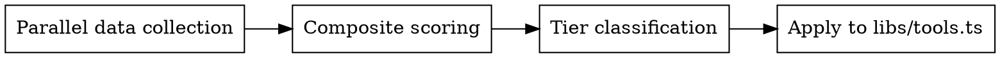

# Ordering Tools by Popularity

Data-driven approach to ordering developer tools in OmniKit based on real-world search trends, usage frequency, and competitive analysis. The TOOLS array order controls homepage display (All view + ToolsDrawer), TOOL_CATEGORIES controls grouped view, QUICK_ACCESS_DEFAULT controls the quick access bar.

## When to Use

- Adding a new tool to OmniKit (where to place it)
- Periodic re-ranking (quarterly recommended)
- User requests tool order optimization
- After significant market shifts (new frameworks, breaking changes)

When NOT to use: one-off UI tweaks, bug fixes, non-ordering tool changes.

## Data Sources

| Source                               | What it measures         | API/URL                                                                |
| ------------------------------------ | ------------------------ | ---------------------------------------------------------------------- |
| **npm monthly downloads**            | Library usage volume     | `api.npmjs.org/downloads/point/last-month/{package}`                   |
| **Google Keyword Planner / Semrush** | Search keyword volume    | Paid tools or web-reader on research sites                             |
| **Stack Overflow tags**              | Developer confusion/need | `api.stackexchange.com/2.3/tags/{tag}/info`                            |
| **Competitor tool ordering**         | Industry consensus       | Visit 5+ dev tool sites, record ordering                               |
| **Industry reports**                 | Aggregated statistics    | Search "developer tools statistics" or "developer tool usage rankings" |

**Key insight for web tools**: npm downloads measure library usage, but web tools serve a different niche — one-off visual tasks (JWT decode, regex test, color conversion). Always cross-reference with SO questions and search volume, not npm alone.

## Research Workflow

### Phase 1: Parallel Data Collection

Launch these simultaneously (explore + librarian agents + web search):

1. **npm downloads**: Check top packages per tool category
2. **Search volume**: Query keyword data for core terms (e.g., "json formatter", "base64 decoder", "jwt decoder", "uuid generator", "regex tester")
3. **Stack Overflow**: Get tag question counts per tool domain
4. **Competitor analysis**: Read 5+ competitor dev tool sites — record tool ordering
5. **Industry reports**: Fetch latest aggregated statistics (BytePane, KappaKit, etc.)

### Phase 2: Composite Scoring

| Dimension             | Weight | Reasoning                        |
| --------------------- | ------ | -------------------------------- |
| Search volume         | 40%    | Direct user intent for web tools |
| Competitor consensus  | 25%    | Industry-proven ordering         |
| npm/package downloads | 20%    | Actual usage volume              |
| Site traffic data     | 15%    | Real-world web tool demand       |

Compute composite score per tool. Tools with missing data in one dimension redistribute weight proportionally.

### Phase 3: Tier Classification

| Tier   | Criteria                                            | Typical count           |
| ------ | --------------------------------------------------- | ----------------------- |
| Tier 1 | Daily use, massive search volume (>100K/mo keyword) | 3-5                     |
| Tier 2 | Very frequent, high search volume (10-100K/mo)      | 5-7                     |
| Tier 3 | Regular, moderate search volume (1-10K/mo)          | 5-7                     |
| Tier 4 | Occasional / niche                                  | Remaining               |
| Tier 5 | Reference / lookup only                             | ASCII tables, code refs |

### Phase 4: Apply to `libs/tools.ts`

1. **TOOLS array**: Order by tier (Tier 1 first). Within same tier, order by composite score descending.
2. **TOOL_CATEGORIES**: Keep category structure. Reorder tools within each category by popularity.
3. **QUICK_ACCESS_DEFAULT**: Top 6 most-accessed tools. Prefer tools where web UI provides significant value over CLI/library alternatives.

No comments in the TOOLS array — the ordering itself is the documentation.

## Reference Data (2026 Baseline)

| Tool           | npm Downloads/Mo | SO Questions | Search Vol | Key Insight                              |
| -------------- | ---------------- | ------------ | ---------- | ---------------------------------------- |
| JSON           | 2.96B            | 361K         | 301K/mo    | Universal data format, #1 by far         |
| UUID           | 1.54B            | 3.3K         | ~90K/mo    | Simple API, massive usage                |
| Base64         | 456M             | 11K          | ~200K/mo   | Essential for API/JWT work               |
| JWT            | 408M             | 18K          | ~150K/mo   | 3.1B tokens generated daily              |
| Hashing        | 328M             | 30K          | ~70K/mo    | Fragmented across 6+ packages            |
| URL Encoding   | 249M             | 1K           | ~40K/mo    | 91% of APIs use it                       |
| Regex          | built-in         | 261K         | ~55K/mo    | Most asked-about, highest web tool value |
| Unix Timestamp | —                | —            | ~50K/mo    | Log debugging essential                  |
| Diff           | —                | —            | ~20K/mo    | IDE partially substitutes                |
| Password       | 32M              | 2.3K         | ~50K/mo    | Universal need                           |
| Color          | —                | —            | ~200K/mo   | Front-end CSS debugging                  |
| Cron           | —                | —            | ~30K/mo    | DevOps niche, syntax error-prone         |
| QR Code        | —                | —            | ~300K/mo   | General audience, less dev-specific      |
| Markdown       | —                | —            | ~80K/mo    | Editor substitutes exist                 |

When re-ranking, update this table with fresh data. Do NOT assume rankings are stable across years.

## Common Mistakes

| Mistake                             | Fix                                                                        |
| ----------------------------------- | -------------------------------------------------------------------------- |
| Ordering by personal preference     | Use 3+ data sources minimum                                                |
| Using only npm downloads            | npm measures library usage, not web tool demand                            |
| Placing reference tools too high    | ASCII/HTML entities are low-frequency lookups                              |
| Ignoring web vs library distinction | Regex has low npm but 261K SO questions — web tools fill a different niche |
| Placing QR Code in top tier         | High search volume but general audience, not dev-specific                  |
| Assuming rankings are permanent     | Re-check quarterly; new frameworks shift tool demand                       |

## Validation

After reordering, verify:

- [ ] Each category's tools ordered by popularity within that category
- [ ] TOOLS array reflects tier structure (high → low frequency)
- [ ] QUICK_ACCESS_DEFAULT contains top 6 by composite score
- [ ] No tool appears in wrong category
- [ ] `lsp_diagnostics` clean on `libs/tools.ts`
- [ ] Build passes
